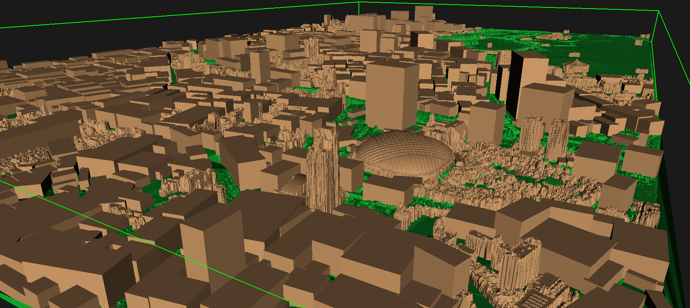

# 東京の3D都市モデルを作ってみた

## 見どころ

さらに見たい方は[こちら](result/pictures/)に画像がある

## 背景
[画像・映像コンテンツ演習１](https://sites.google.com/g.chuo-u.ac.jp/cuise/business#h.3f5p0dds8z9c)でのプロジェクトでの成果を公開する。[四角いオレンジ](https://sites.google.com/g.chuo-u.ac.jp/cuise/classes/2025#h.220er6monijm)が我々のチームが行ったものである。[ポスターはこちら](result/poster.pdf)。デプロイは入力データが非公開なのでできない。

## プロジェクト概要
与えられた点群をプログラムで処理して3D都市モデルを制作する。
### 入力データ
約1m間隔の格子状標高値のデータ。[詳しいデータ仕様はこちら](result/data_spec.pdf)。

## 3Dモデル
[VRMLファイル](result/city_model.wrl)をVRML Viewerで開きます。

## アルゴリズム
1. 点群のデータを地面or建物に分類する。
1. ノイズを処理
1. 建物を直方体でポリゴン生成
1. 地面もポリゴン生成

[ポスター](result/poster.pdf)に詳しく記載。
