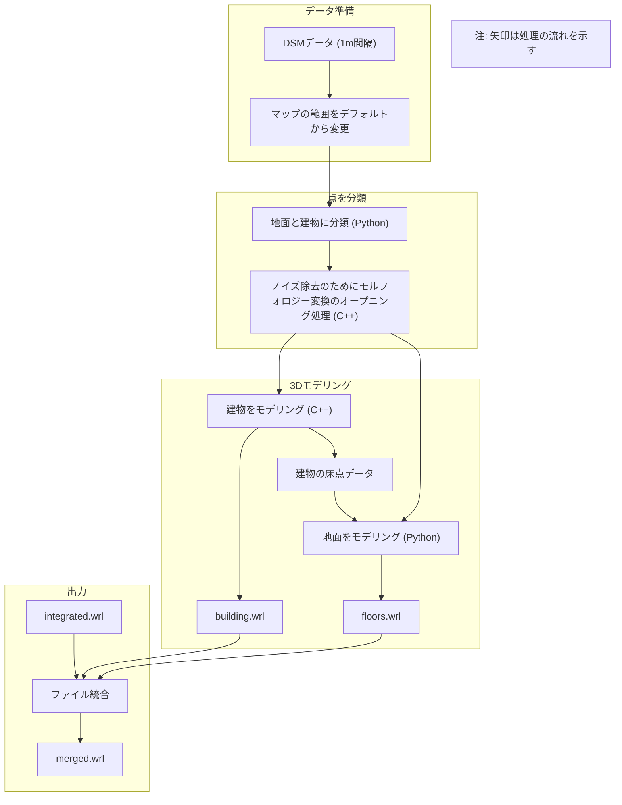

```mermaid
flowchart TD
  Note["注: 矢印は処理の流れを示す"]

  subgraph DataPrep["データ準備"]
    RAW["DSMデータ (1m間隔)"]
    CLIP["マップの範囲をデフォルトから変更"]

    RAW --> CLIP
  end

  subgraph Labeling["点を分類"]
    HANTEI["地面と建物に分類 (Python)"]
    OPENING["ノイズ除去のためにモルフォロジー変換のオープニング処理 (C++)"]

    CLIP --> HANTEI --> OPENING

    click OPENING "/system/opening.md" "システム構成図"
  end

  subgraph Model3D["3Dモデリング"]
    BUILD["建物をモデリング (C++)"]
    FLOORS["建物の床点データ"]
    GROUND["地面をモデリング (Python)"]
    BVRML["building.wrl"]
    GVRML["floors.wrl"]

    OPENING --> BUILD --> BVRML
    BUILD --> FLOORS --> GROUND --> GVRML
    OPENING --> GROUND

    click BUILD "/system/makeBuilding.md" "システム構成図"
  end

  subgraph Export["出力"]
    INTFILE["integrated.wrl"]
    INTEGRATE["ファイル統合"]
    MERGED["merged.wrl"]
    
    INTFILE --> INTEGRATE
    BVRML --> INTEGRATE
    GVRML --> INTEGRATE
    INTEGRATE --> MERGED
  end
```