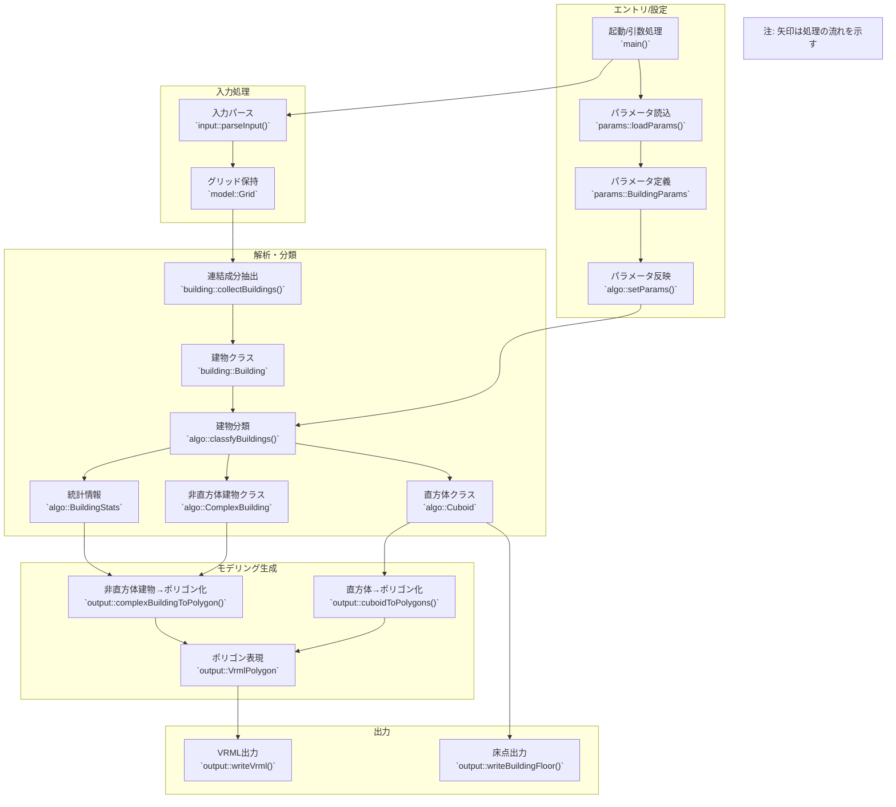

```mermaid
flowchart TD
  Note["注: 矢印は処理の流れを示す"]

  subgraph Entry["エントリ/設定"]
    Main["起動/引数処理<br/>`main()`"]
    ParamLoad["パラメータ読込<br/>`params::loadParams()`"]
    ParamType["パラメータ定義<br/>`params::BuildingParams`"]
    SetParams["パラメータ反映<br/>`algo::setParams()`"]
  end

  subgraph Input["入力処理"]
    Parse["入力パース<br/>`input::parseInput()`"]
    Grid["グリッド保持<br/>`model::Grid`"]
  end

  subgraph Analysis["解析・分類"]
    Collect["連結成分抽出<br/>`building::collectBuildings()`"]
    Building["建物クラス<br/>`building::Building`"]
    Classify["建物分類<br/>`algo::classfyBuildings()`"]
    Cuboid["直方体クラス<br/>`algo::Cuboid`"]
    Complex["非直方体建物クラス<br/>`algo::ComplexBuilding`"]
    Stats["統計情報<br/>`algo::BuildingStats`"]
  end

  subgraph Geometry["モデリング生成"]
    CuboidPoly["直方体→ポリゴン化<br/>`output::cuboidToPolygons()`"]
    ComplexPoly["非直方体建物→ポリゴン化<br/>`output::complexBuildingToPolygon()`"]
    Polygon["ポリゴン表現<br/>`output::VrmlPolygon`"]
  end

  subgraph Output["出力"]
    VrmlOut["VRML出力<br/>`output::writeVrml()`"]
    FloorOut["床点出力<br/>`output::writeBuildingFloor()`"]
  end

  Main --> Parse
  Main --> ParamLoad --> ParamType --> SetParams --> Classify
  Parse --> Grid --> Collect --> Building --> Classify
  Classify --> Cuboid
  Classify --> Complex
  Classify --> Stats
  Cuboid --> CuboidPoly --> Polygon --> VrmlOut
  Complex --> ComplexPoly --> Polygon
  Stats --> ComplexPoly
  Cuboid --> FloorOut
```